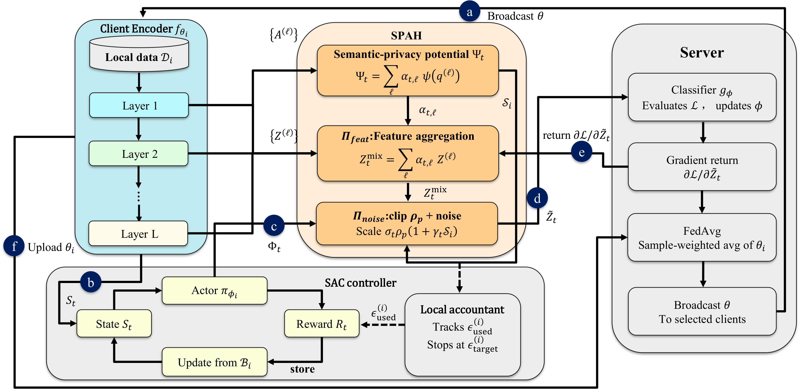

# RAP-SFL

**Reinforcement-driven Adaptive Perturbation at the Split Point of Federated Learning**

Official implementation of the RAP-SFL system described in the paper of the same name
(ICASSP 2027). RAP-SFL replaces the static, uniformly-configured noise injection of
forward-pass local differential privacy with a **per-client learned policy** that decides,
at every local step, *which* encoder layers to release, *how* to clip them, *how much*
noise to add, and *how* to distribute that noise across tokens — under a hard per-client
sequence-level LDP budget.

<p align="center">
  
</p>

---

## Method

Each client keeps a BERT-family **encoder**; the server keeps the **classifier**. Only
perturbed smashed features cross the split point in the forward direction, and only
encoder parameters are aggregated.

Per client *i*, at local step *t*:

| Component | Role |
|---|---|
| **SAC controller** | A Soft Actor-Critic agent observes a compact state `S_t` (embedding-norm statistics, batch loss and gradient norm, consumed budget and remaining ratio, attention entropy) and emits `A_t`, parsed into the control tuple `Φ_t = (α_t, ρ_t, σ_t, γ_t)`. |
| **ALF** — Adaptive Layer Fusion | `α_t` becomes per-layer weights over encoder hidden states; the released representation is their weighted fusion rather than a single fixed layer. |
| **SPAH** — Split-Point Adaptive Perturbation Head | Executes `Φ_t`: fuses layers, partitions the embedding into blocks, clips each block at `ρ_t`, injects Gaussian noise scaled by `σ_t`, and applies the SANA token mask. |
| **SANA** — Semantics-Aware Noise Allocation | `γ_t` modulates per-token noise using `[CLS]` attention, so semantically concentrated tokens receive less perturbation. |
| **Local accountant** | A per-client PRV accountant charges every release against that client's own `ε` budget. ALF and SANA share one semantic-privacy potential `Ψ_t`, hence one budget slice. Training stops for a client when its budget is exhausted. |
| **FedAvg** | The server aggregates client encoders by sample weight. Aggregating encoders only lets heterogeneous local policies coexist with a shared representation. |

The guarantee is **sequence-level LDP per client**, and it is preserved across aggregation
and across the SAC update by post-processing immunity.

---

## Repository layout

| File | Contents |
|---|---|
| [`train_rap_sfl.py`](train_rap_sfl.py) | Main trainer. Federated loop, Dirichlet non-IID partitioning, client encoders, server classifier, split-point gradient exchange, per-client SAC controllers, PRV-based local accountants, FedAvg. Also implements the non-private and DP-FedAvg baselines, the FedProx / SCAFFOLD hooks, the component ablations, and the per-setting hyperparameter presets. |
| [`rap_sfl_components.py`](rap_sfl_components.py) | SAC actor / critics / replay buffer, state-vector construction, action parsing into `Φ_t`, reward functions, and `apply_spah` (layer fusion + block clipping + noise injection + SANA mask). |
| [`privacy_analysis.py`](privacy_analysis.py) | Attack evaluation against released smashed features: SIP and NaMoE embedding inversion, membership inference, semantic similarity, and MINE mutual-information estimation. |
| [`ldp_mechanisms.py`](ldp_mechanisms.py) | Standalone LDP noise mechanisms and calibration utilities (Matrix Gaussian, Laplace, Gaussian; PRV-based noise-multiplier solver). Not imported by the trainer. |
| [`requirements.txt`](requirements.txt) | Python dependencies. |

---

## Installation

```bash
conda create -n rapsfl python=3.10 -y
conda activate rapsfl
pip install -r requirements.txt
```

Datasets are fetched automatically from Hugging Face Hub on first run
(`glue/sst2`, `imdb`, `glue/qqp`, `glue/mnli`). Encoder weights are downloaded from
Hugging Face Hub as well. A CUDA device is strongly recommended; the code falls back to
CPU but training will be slow.

---

## Datasets and encoders

| Task | HF dataset | Labels | Eval split | Text field(s) |
|---|---|---|---|---|
| SST-2 | `glue/sst2` | 2 | `validation` | `sentence` |
| IMDb | `imdb` | 2 | `test` | `text` |
| QQP | `glue/qqp` | 2 | `validation` | `question1`, `question2` |
| MNLI | `glue/mnli` | 3 | `validation_matched` | `premise`, `hypothesis` |

Encoders: `bert-base-uncased`, `roberta-base`, `distilbert-base-uncased`.
`num_labels` and the transformer block count are inferred automatically.

---

## Usage

### RAP-SFL

Every `(dataset, encoder)` pair reported in the paper has a preset carrying its
hyperparameters. A preset only supplies defaults — any explicit flag overrides it.

```bash
python train_rap_sfl.py --preset sst2_bert
python train_rap_sfl.py --preset sst2_roberta
python train_rap_sfl.py --preset imdb_bert --epsilon 1.0
python train_rap_sfl.py --preset qqp_distilbert
```

Available presets:

```
sst2_bert      sst2_roberta      sst2_distilbert
imdb_bert      imdb_roberta      imdb_distilbert
qqp_bert       qqp_roberta       qqp_distilbert
mnli_bert      mnli_roberta      mnli_distilbert
```

Shared settings applied to every run: 5 clients, Dirichlet `α = 0.5` (non-IID), all
clients participating each round, 45 federated rounds × 6 local steps, batch size 32,
`ε = 8.0`, `δ = 1e-5`, seed 42, budget-driven stopping enabled. See `COMMON_DEFAULTS`
in `train_rap_sfl.py`; `PRESET_NOTES` records why each preset departs from those defaults.

The trainer prints the fully resolved configuration (preset values plus any overrides)
in a banner at start-up, so a launched run is self-documenting.

### Baselines

```bash
# Centralized: single client holding all data, no DP, no RL
python train_rap_sfl.py --preset sst2_bert --num_clients 1 --no_dp --disable_rl

# FedAvg / SplitFed over encoders: no DP, no RL
python train_rap_sfl.py --preset sst2_bert --no_dp --disable_rl

# FedProx (proximal term μ)
python train_rap_sfl.py --preset sst2_bert --no_dp --disable_rl --fedprox_mu 0.1

# SCAFFOLD (control-variate correction)
python train_rap_sfl.py --preset sst2_bert --no_dp --disable_rl --scaffold --scaffold_lr 1.0

# DP-FedAvg (central DP: Gaussian noise on the aggregated encoder)
python train_rap_sfl.py --preset sst2_bert --disable_rl --dp_fedavg_sigma 0.01
```


### Ablations

```bash
python train_rap_sfl.py --preset sst2_bert --disable_rl                  # static noise policy, no SAC
python train_rap_sfl.py --preset sst2_bert --ablation_mode no_alf        # last layer only, no fusion
python train_rap_sfl.py --preset sst2_bert --ablation_mode no_sana       # uniform clipping and noise
python train_rap_sfl.py --preset sst2_bert --no_dp --disable_rl          # non-private upper bound
```

### Privacy attacks

```bash
python privacy_analysis.py \
    --model_path ./output/<run_dir> \
    --task_name sst2 \
    --model_name bert-base-uncased \
    --victim_kind rap_sfl \
    --attacks sip,namoe,mia \
    --epsilon 8.0
```

`--attacks` is a comma-separated list drawn from `emb_inv,mia,sip,namoe,mi`; the default
is `all`.

`--victim_kind` selects the mechanism under attack (`rap_sfl`, `dp_fedavg`,
`non_private`). `--num_blocks` must match the encoder used (12 for BERT/RoBERTa, 6 for
DistilBERT). The trainer writes `best_encoder.pt`, `best_classifier.pt` and
`rl_policy.pt` into its output directory.

### Output

Each run writes to `--output_dir` (default `./output`):

```
training_history.json          per-round accuracy, loss, and per-client ε consumption
convergence_curves_final.png   accuracy and budget trajectories
best_encoder.pt                global encoder state dict
best_classifier.pt             server classifier state dict
rl_policy.pt                   actor + state encoder + state-normalization stats for one
                               reference client (active_clients[0]); critics are not saved
alf_layer_weights_client<i>.csv  per-layer fusion weights, one file per client (with --alf_logging)
```

---


## Citation

```bibtex
@inproceedings{huang2027rapsfl,
  title     = {RAP-SFL: Reinforcement-driven Adaptive Perturbation at the Split Point
               of Federated Learning},
  author    = {Huang, Jiawang and Wang, Ran and Chen, Aidong and Ye, Fangwen and Xu, Cheng},
  booktitle = {Proc. IEEE Int. Conf. Acoust., Speech Signal Process. (ICASSP)},
  year      = {2027}
}
```

## License

MIT — see [LICENSE](LICENSE).
